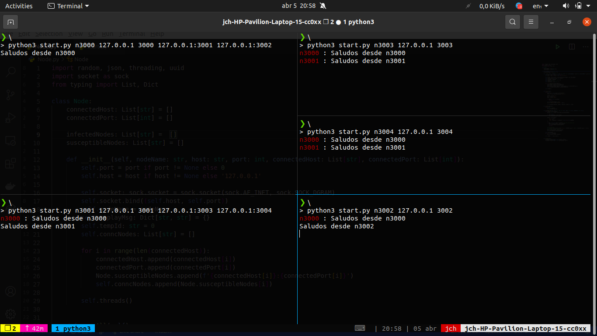

#### José Carlos Hernández Piñera C411  (Gossip Protocol)


Para ejecutar el proyecto solo se debe correr con python el archivo `start.py` de la siguiente manera:

```bash
~$ python start.py `name_in_chat` `host` `port` `host1:port1` `host2:port2` `hostn:portn` 
```

donde:

- name_in_chat => es el nombre con el que aparece el nodo que se levanta en estos momentos.
- host => es el host donde está el nodo que se levanta en estos momentos.
- port => es el puerto por donde está el nodo que levanta en estos momentos.
- host_i:port_i => nodos a los que está conectado el nodo que se levanta en estos momentos.




​													**Ejemplo de la ejecución del proyecto**

La topología de la red es la siguiente(todos están en _localhost_ pero en diferentes puertos de la siguiente manera):


​				             				--- 3003

​				--- 3001				

​											--- 3004

3000			

​				--3002


Los que están en el nivel _i_ son hijos de los que aparecen en el _i - 1_  